# Pandas

> 판다스는 다량의 데이터를 엑셀의 형태로 보여주는 것이 가능
>
> Numpy를 사용하여 숫자 계산에 대해서는 강력한 퍼포먼스를 보임


- 판다스 라이브러리 호출 후 파일 읽어와 저장

```python
import pandas as pd
data_frame = pd.read_csv('data/friend_list.csv')
```


- 데이터 출력

```python
data_frame
```


- 앞부터 두개만 출력

```python
data_frame.head(2)
```

- 뒤부터 두개만 출력

```python
data_frame.tail(2)
```


> pandas 에서 column은 Series이며 pandas data는 series의 집합체

```python
type(data_frame.job)
=> pandas.core.series.Series
```


- 데이터 입력

```python
s1 = pd.core.series.Series( [1, 2, 3] )
s2 = pd.core.series.Series( ['one', 'two', 'three'] )
pd.DataFrame(data=dict(num=s1, word=s2))
```

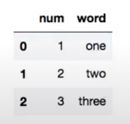


- pandas 설치, 버전 확인

```python
!conda list | grep pandas
```

- csv파일 가져오기

```python
df = pd.read_csv('data/friend_list.csv')
df
```

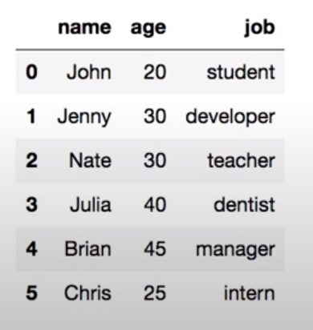


- tab으로 구분된 파일 불러오기

```python
df = pd.read_csv('data/friend_list_tam.txt', delimiter = '\t')
df
```

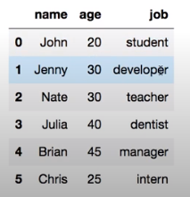


- column 이름이 설정되어 있지 않은 데이터 불러오기

```python
df = pd.read_csv('data/friend_list_no_head.csv', header = None)
df.columns = ['name', 'age', 'job']
df
```

- 같은방법

```python
df = pd.read_csv('data/friend_list_no_head.csv', header = None, names = ['name', 'age', 'job'])
df
```

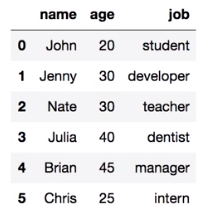


#### 데이터프레임 생성

- 딕셔너리를 통해 생성

> 딕셔너리같은 경우에는 key값의 순서가 보장이 되지 않는다

```python
friend_dict_list = [
    {'name': 'John', 'age': 25, 'job': 'student'},
    {'name': 'Nate', 'age': 30, 'job': 'teacher'}
]
df = pd.DataFrame(friend_dict_list)
df.head()
```

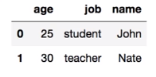

- 순서 정렬

```python
df = df[['name', 'age', 'job']]
df.head()
```

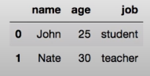

- 한번에 생성과 정렬

```python
from collections import OrderedDict
friend_ordered_dict = OrderedDict(
	[
        ('name', ['John', 'Nate']),
        ('age', [25, 30]),
        ('job', ['student', 'teacher'])
    ]
)
df = pd.DataFrame.from_dict(friend_ordered_dict)
df.head()
```

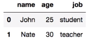


- 리스트를 사용하여 생성

```python
friend_list = [
    ['John', 20, 'student'],
    ['Nate', 30, 'teacher'],
]
column_name = ['name', 'age', 'job']
df = pd.DataFrame.from_records(friend_list, columns = column_name)
df.head()
```

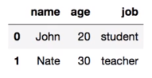

- column 따로 설정없이 한번에 생성

```python
friend_list = [
    ['name', ['John', 'Nate']],
    ['age', [20, 30]],
    ['job', ['student', 'teacher']]
]
df = pd.DataFrame.from_items(friend_list)
df.head()
```

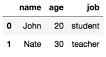


#### 데이터프레임을 파일로 저장


```python
friends = [{'name': 'Jone', 'age': 20, 'job': 'student'},
          {'name': 'Jenny', 'age': 30, 'job': None},
          {'name': 'Nate', 'age': 30, 'job': 'teacher'}]
df = pd.DataFrame(friends)
df = df[['name', 'age', 'job']]
df.head()
```

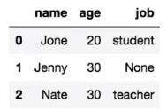

- 저장하기

```python
df.to_csv('friends.csv')
=> default값으로 index = True, header = True 가 설정
df.to_csv('friends.csv', index = True, header = True)
```

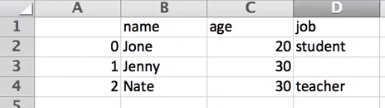

- row에 숫자 없이 출력

```python
df.to_csv('friends.csv', index = False, header = True)
```

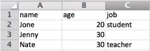

- None값을 다른값으로 지정

```python
df.to_cssv('freinds.csv', index = False, header = False, na_rep = '-') 
```

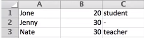


#### 데이터프레임 행, 열 선택 및 필터 하기


```python
friend_list = [
    ['name', ['John', 'Jenny', 'Nate']],
    ['age', [20, 30, 30]],
    ['job', ['student', 'developer', 'teacher']]
]
df = pd.DataFrame.from_items(friend_list)
df
```

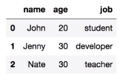

- 선택하여 출력

```python
df[1:3]
```

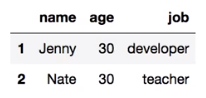

- 선택한 결과값을 저장

```python
df = df[1:3]
df
```

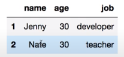

- 불연속적 선택 출력

```python
df.loc[ [0, 2] ]
```

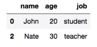


#### column의 컨디션에 따라서 출력

```python
df[df.age > 25]
```

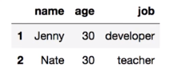

```python
df.query('age>25')
```

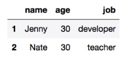

```python
df[ (df.age>25) & (df.name == 'Nate') ]
```

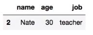


#### Filter Column

- index로 필터

```python
friend_list = [
    ['John', 20, 'student'],
    ['Jenny', 30, 'developer'],
    ['Nate', 30, 'teacher'],
]
df = pd.DataFrame.from_records(friend_list)
df
```

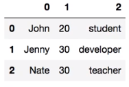

- 모든 row를 원한다, 0부터 2의 컬럼

```python
df.iloc[:,0:2]
```

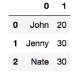


- column 이름을 통해 필터

```python
df = pd.read_csv('data/friend_list_no_head.csv', header = None, names=['name', 'age', 'job'])
```

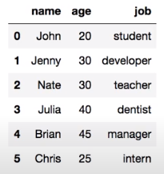

- name과 age만 불러오기

```python
df_filtered = df[['name', 'age']]
df_filtered
```

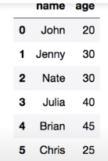

- filter를 통해 불러오기

```python
df.filter(items=['age', 'job'])
```

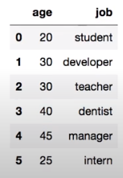

- column이름에 'a'를 갖는값만 불러오기

```python
df.filter(like='a', axis=1)
```

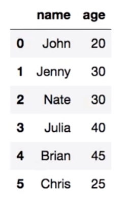

-  column이름 중에 'e'로 끝나는 값만 불러오기

```python
df.filter(regex='e$', axis=1) 
```

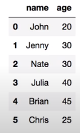


#### row와 column의 삭제


```python
friends = [{'age': 15, 'job': 'student'},
          {'age': 25, 'job': 'developer'},
          {'age': 30, 'job': 'teacher'}]
df = pd.DataFrame(friends,
                 index= ['John', 'Jenny', 'Nate'],
                 columns = ['age', 'job'])
df
```

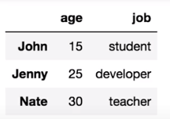


- index로 삭제

```python
df.drop(['John', 'Nate'])
df
```

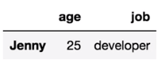

- inplace로 삭제

```python
df.drop(['John', 'Nate'], inplace = True)
df
```


```python
friends = [{'name': 'John', 'age': 15, 'job': 'student'},
          {'name': 'Ben', 'age': 25, 'job': 'developer'},
          {'name': 'Jenny', 'age': 30, 'job': 'teacher'}]
df = pd.DataFrame(friends,
                 columns = ['name', 'age', 'job'])
df
```


- index로 삭제

```python
df = df.drop(df.index[[0, 2]])
df
```

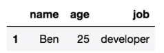

- 나이가 20 이상인 row를 삭제

```python
df = df[df.age > 20]
df
```

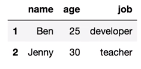

- age 컬럼 삭제

```python
df = df.drop('age', axis=1)
df
```

>axis=1은 컬럼중에서라는 뜻

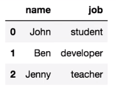

- inplace로 컬럼 삭제

```python
df.drop('age', axis=1, inplace = True)
df
```

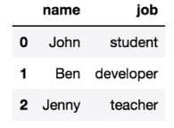


